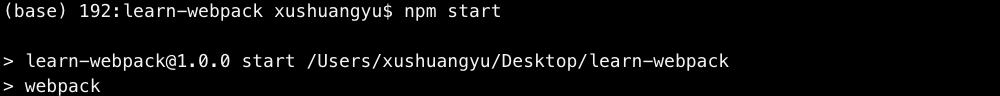
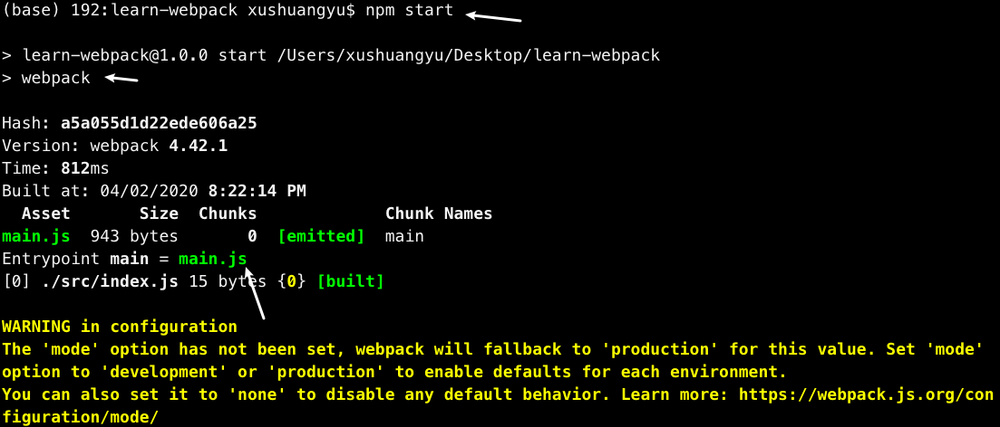
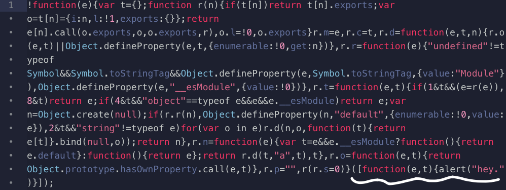

### learn-webpack

reference:
- [Webpack中文文档](https://www.webpackjs.com/concepts/)

---
文件结构：
```
|- .git
|- assets
|- README.md
|- .gitignore
|- src
  |- app
    |- utils
      - inputs-are-valid.js
      - parse-inputs.js
    - alert.service.js
    - app.js
    - component.service.js
|- index.html
```

#### 0. 初始化 npm
```
npm init -y
```

此时出现package.json文件:

```
|- .git
|- assets
|- README.md
|- .gitignore
|- src
  |- app
    |- utils
      - inputs-are-valid.js
      - parse-inputs.js
    - alert.service.js
    - app.js
    - component.service.js
|- package.json
|- index.html
```

- 将其中的script清空，同时加上private配置

package.json:
```js
"private": true,
"scripts": {

}
```

#### 1. 安装 webpack & webpack-cli
```
npm install --save-dev webpack webpack-cli
```

安装成功后，package.json文件出现：
```js
"devDependencies": {
  "webpack": "^4.42.1",
  "webpack-cli": "^3.3.11"
}
```

- 在package.json文件中自定义一个script

package.json:
```js
"scripts": {
  "start": "webpack"
}
```
意味着，在终端执行```npm start```命令时会执行```webpack```命令。

- 终端在```/learn-webpack```目录下执行```npm start```命令


.png)

会发现有如上的报错，原因是 webpack 配置中的入口（entry）默认值为```/src/index.js```，而当前项目中的src文件夹中没有对应的 JS 执行入口文件 ```index.js```，所以会报错。[参考](https://www.webpackjs.com/concepts/#%E5%85%A5%E5%8F%A3-entry-)

- 在/src目录下新建立一个文件index.js
index.js:
```js
alert('hey.');
```

```
|- src
  |- app
    |- utils
      - inputs-are-valid.js
      - parse-inputs.js
    - alert.service.js
    - app.js
    - component.service.js
  - index.js
```

- 再次执行```npm start```命令



先忽略warning，可以看到，命令执行成功，并且产生了一个```/dist```文件夹，里面有一个```main.js```文件，是 webpack 打包好的执行文件。

```
|- .git
|- assets
|- dist
  - main.js
|- node_modules
|- README.md
|- .gitignore
|- src
|- package.json
|- index.html
```

main.js:



文件开始是 webpack 产生的默认配置代码，在文件代码结尾处可以看到入口文件```index.js```中的内容。

- 在```index.html```尾部引入此打包好的文件，打开项目页面，可以看到```index.js```中的内容成功执行。

index.html:
```html
<body>
  ...
  <script src="./dist/main.js"></script>
</body>
```


