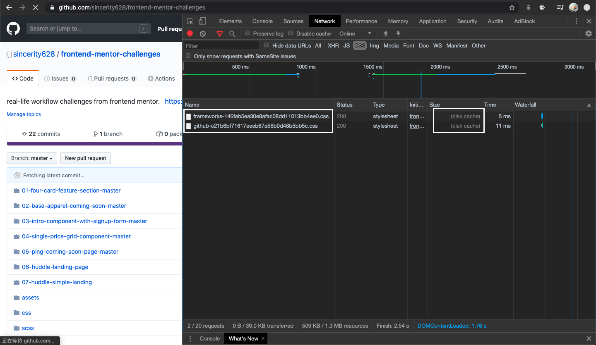

<h1 id="0">learn-webpack</h1>

reference:
- [Webpack中文文档](https://www.webpackjs.com/concepts/)

目录：

- [1. 初始化 npm](#1)
- [2. 安装 webpack & webpack-cli](#2)
- [3. 管理模块间的关系](#3)
- [4. 配置 webpack](#4)
- [5. 加载 css loader](#5)
- [6. 加载 scss loader](#6)
- [7. cache 和插件](#7)

---
### 文件结构：
```
|- .git
|- assets
|- README.md
|- .gitignore
|- src
  |- app
    |- utils
      - inputs-are-valid.js
      - parse-inputs.js
    - alert.service.js
    - app.js
    - component.service.js
|- index.html
```

<h3 id="1">1. 初始化 npm</h3>

```
npm init -y
```

此时出现package.json文件:

```
|- .git
|- assets
|- README.md
|- .gitignore
|- src
  |- app
    |- utils
      - inputs-are-valid.js
      - parse-inputs.js
    - alert.service.js
    - app.js
    - component.service.js
|- package.json
|- index.html
```

- 将其中的script清空，同时加上private配置

package.json:
```js
"private": true,
"scripts": {

}
```

##### [⬆️回到顶部⬆️](#0)

---

<h3 id="2">2. 安装 webpack & webpack-cli</h3>

```
npm install --save-dev webpack webpack-cli
```

安装成功后，package.json文件出现：
```js
"devDependencies": {
  "webpack": "^4.42.1",
  "webpack-cli": "^3.3.11"
}
```

- 在package.json文件中自定义一个script

package.json:
```js
"scripts": {
  "start": "webpack"
}
```
意味着，在终端执行```npm start```命令时会执行```webpack```命令。

- 终端在```/learn-webpack```目录下执行```npm start```命令


.png)

会发现有如上的报错，原因是 webpack 配置中的入口（entry）默认值为```/src/index.js```，而当前项目中的src文件夹中没有对应的 JS 执行入口文件 ```index.js```，所以会报错。[参考](https://www.webpackjs.com/concepts/#%E5%85%A5%E5%8F%A3-entry-)

- 在/src目录下新建立一个文件index.js
index.js:
```js
alert('hey.');
```

```
|- src
  |- app
    |- utils
      - inputs-are-valid.js
      - parse-inputs.js
    - alert.service.js
    - app.js
    - component.service.js
  - index.js
```

- 再次执行```npm start```命令


先忽略warning，可以看到，命令执行成功，并且产生了一个```/dist```文件夹，里面有一个```main.js```文件，是 webpack 打包好的执行文件。

```
|- .git
|- assets
|- dist
  - main.js
|- node_modules
|- README.md
|- .gitignore
|- src
|- package.json
|- index.html
```

main.js:


文件开始是 webpack 产生的默认配置代码，在文件代码结尾处可以看到入口文件```index.js```中的内容。

- 在```index.html```尾部引入此打包好的文件，打开项目页面，可以看到```index.js```中的内容成功执行。

index.html:
```html
<body>
  ...
  <script src="./dist/main.js"></script>
</body>
```


这就意味着，我们可以在入口文件调用启动项目所需的函数，然后在文件中管理好各个接口之间的调用关系（利用```export```和```import```），最后只需要生成一个总的文件，并且只调用一次就可以达到目的，而不需要关注各个文件的调用顺序（webpack会解决这个问题）。

##### [⬆️回到顶部⬆️](#0)

---

<h3 id="3">3. 管理模块间的关系</h3>

分析项目需求，每个文件之间的依赖关系如下：


- 根据这个关系，在各个文件中进行 import 和 export，然后在```index.js```文件中调用```run()```函数。

index.js:
```js
import { AlertService } from './app/alert.service';
import { ComponentService } from './app/component.service';
import { run } from './app/app';

const alertService = new AlertService();
const componentService = new ComponentService();

run(alertService, componentService);
```

- 重新打包```index.js```文件


可以看到，webpack 成功将各个模块联系到了一起，集合在```main.js```文件中。

- 在index.html文件中，只需调用打包好的main.js文件即可，不需要像之前按照顺序将每个项目依赖文件全部引入了。

index.html（原）：
```html
<body>
  ...
  <script src="./src/app/alert.service.js"></script>
  <script src="./src/app/component.service.js"></script>
  <script src="./src/app/utils/inputs-are-valid.js"></script>
  <script src="./src/app/utils/parse-inputs.js"></script>
  <script src="./src/app/app.js"></script>
  <script src="./dist/main.js"></script>
<body>
```

index.html（现）：
```html
<body>
  ...
  <script src="./dist/main.js"></script>
<body>
```

##### [⬆️回到顶部⬆️](#0)

---

<h3 id="4">4. 配置 webpack</h3>

以上都是 webpack 的默认常规操作，因为我们还没有对它进行实际的配置。

- 新建一个```webpack.config.js```文件（名字随意）

```
|- .git
|- assets
|- dist
  - main.js
|- node_modules
|- README.md
|- .gitignore
|- src
|- package.json
|- index.html
|- webpack.config.js
```

- 根据文档，将之前的常规配置写下来并保存：
```js
const path = require('path');

module.exports = {
  mode: 'development', // 生成的main.js文件不被聚合，可以更好的理解代码
  devtool: 'none', // 更好理解main.js中的内容
  entry: './src/index.js', // 入口
  output = { // 输出打包文件
    filename: 'main.js',
    path: path.resolve(__dirname, 'dist')
  }
}
```

- 要使用我们写好的配置，在```package.json```文件中修改

package.json:
```js
{
  "scripts": {
    "start": "webpack --config webpack.config.js"
    // webpack后面加上 --config 配置文件名称
  },
}
```

- 再次终端运行```npm start```，查看生成的```/dist/main.js```文件

main.js:


##### [⬆️回到顶部⬆️](#0)

---

<h3 id="5">5. 加载 css loader</h3>

- 在```/src```文件夹中创建一个```main.css```文件

main.css:
```css
body {
  background-color: lightblue;
}
```

```
|- src
  |- app
  - index.js
  - main.css
```

要想使用这个样式文件，若不直接在```index.html```中调用的话，我们可以在入口文件中，将这个样式文件加载进来，然后使用 webpack 中的 loader 会自动在项目中引入对应的样式。

- 在入口文件```index.js```中引入```main.css```
```js
import './main.css';
```

现在查看项目，是不会看到背景颜色的变化的，还需要进一步的配置。

- 参考[文档](https://www.webpackjs.com/loaders/)，找到其中的**样式**部分


- 根据文档提示，安装style-loader和css-loader
```
npm install --save-dev css-loader style-loader
```

安装成功：

package.json:
```js
{
  "devDependencies": {
    "css-loader": "^3.4.2",
    "style-loader": "^1.1.3",
    "webpack": "^4.42.1",
    "webpack-cli": "^3.3.11"
  }
}
```

- 在```webpack.config.js```配置文件中添加对应配置
```js
module.exports = {
  ...
  module: {
    rules: [
      {
        test: /\.css$/, // 所有以.css结尾的文件
        use: ['style-loader', 'css-loader']
        // css-loader 将css代码转化为js代码，存放在输出文件中
        // style-loader 将输出文件中的被转化的样式添加到项目DOM中，以style标签的形式
        // 顺序不要颠倒，先使用的css-loader反而在后！！！
      },
    ]
  }
}
```
[参考：style-loader](https://www.webpackjs.com/loaders/style-loader/)

- 终端执行```npm start```

- 查看项目，发现样式已经被添加


style-loader 生成的```style```标签：


##### [⬆️回到顶部⬆️](#0)

---

<h3 id="6">6. 加载 scss loader</h3>

目前项目中使用了 Bootstarp 样式库，现在要更改其中的一些基本颜色，比如项目中出现的按钮（primary）颜色，需要对其中的样式代码进行覆盖。

- 在```index.html```文件中删除对 Bootstrap 的引用

index.html 中删除:
```html
<link
  rel="stylesheet"
  href="https://stackpath.bootstrapcdn.com/bootstrap/4.1.3/css/bootstrap.min.css"
  integrity="sha384-MCw98/SFnGE8fJT3GXwEOngsV7Zt27NXFoaoApmYm81iuXoPkFOJwJ8ERdknLPMO"
  crossorigin="anonymous"
/>
```

可以看到项目中引用的样式消失了：


- 将 Bootstrap 下载到本地
```
npm i --save-dev bootstrap
```
package.json:
```js
{
  "devDependencies": {
    "bootstrap": "^4.4.1",
    ...
  }
}
```
Bootstrap 是利用 sass 预处理进行打包的，所以此时在项目中也使用 sass。

- 将之前的```main.css```改为```main.scss```，并引入相应的 Bootstrap文件，改变需要改的颜色。

```
|- src
  |- app
  - index.js
  - main.scss
```

main.scss:
```scss
$primary: teal;
$danger: lightsalmon;

@import "~bootstrap/scss/bootstrap";

body {
  background-color: lightblue;
}
```
[参考](https://getbootstrap.com/docs/4.0/getting-started/webpack/)

根据文档：[sass-loader](https://www.webpackjs.com/loaders/sass-loader/)，我们还需要额外的 loaders 来将```.scss```文件中的代码转换为```.css```文件。

- 安装```sass-loader node-sass```
```
npm i --save-dev sass-loader node-sass
```

package.json:
```js
"devDependencies": {
  ...
  "node-sass": "^4.13.1",
  "sass-loader": "^8.0.2"
}
```

- 修改对应的配置文档

webpack.config.js:
```js
module.exports = {
  ...
  module: {
    rules: [
      {
        test: /\.scss$/,
        use: [
          'style-loader', // 将 js 字符串生成为 style 节点
          'css-loader', // 将 css 转化为 commonjs 模块
          'sass-loader' // 将 sass 编译成 css
        ]
      },
    ]
  }
}
```

- 更改入口文件```index.js```中的引用

index.js：
```js
import './main.scss';
```

- 终端执行```npm start```

- 查看项目，发现样式已经被添加，对应的颜色也有变化
  - error-warning 对应的 danger 颜色（原：淡红）改为了 lightsalmon；
  - input outline 对应 primary 颜色（原：蓝）改为了 teal；
  - button 对应的 primary 颜色被改为了teal。


style-loader 生成的```style```标签（连同Bootstrap的样式）：


##### [⬆️回到顶部⬆️](#0)

---

<h3 id="7">7. cache 和插件</h3>

- 打开一个网页，按下 F12 到开发者调试窗口
- 依次点击 Network，CSS，查看网页的样式文件资源。
- 按下```shift+command+R```：Hard Refresh


可以看到，该网页有两个样式文件，后面也显示了文件的对应大小。这里可以发现文件是以```文件名-一串值.css```来命名的。

- 按下```command+R```：Regular Refresh



此时发现文件名没有变化，但是文件大小处，两个文件中的内容都变成了（disk cache）。原因就是浏览器记得这两个文件，然后已经有了这两个文件的缓存，并没有重新到服务器获取这两个文件，而是从cache中调用。

#### 思考？
现在我们的项目依赖文件是```/dist/main.js```，万一，别的网站也拥有同样的```main.js```文件，并且浏览器已经有了对应的缓存，那么我们的项目很可能会造成功能丢失的现象。所以以上就可以解释为什么我们之前看到的那两个文件有着非常长的一段字符串在文件名当中了。

#### 解决。
使用 ContentHash 值来解决问题，根据文件内容来生成一个对应的 Hash 值，添加在文件的名称当中，这样每个不同版本的文件就会有不同的标识，也就不会有上面说的问题了。

#### 实际操作
webpack 当中就提供了对应的方法来生成这个 Hash 值，使用方法也非常简单。[参考](https://webpack.js.org/guides/caching/)

- 修改 webpack 配置文件中的生成文件

将输出文件名称后添加一个```.[contentHash]```即可。

webpakck.config.js:
```js
output: {
  filename: 'main.[contentHash].js',
  path: path.resolve(__dirname, 'dist')
},
```

- 终端执行```npm start```

```
|- dist
  - main.d6808443d76dd7954fad.js
  - main.js
```

可以看到新生成了一个文件，其中```d6808443d76dd7954fad```就是根据当前文件内容生成的对应的 Hash 值。若尝试改变文件内容会看到生成新的文件，如果内容不变的话，名称就不会改变。

- 改变```index.js```文件中的内容

index.js:
```js
(+) console.log('hi');
```

- 终端执行```npm start```

```
|- dist
  - main.c818f4d42b05974d9b03.js
  - main.d6808443d76dd7954fad.js
  - main.js
```

这样就解决了之前说的浏览器缓存问题。

#### 新的问题？

现在项目中的```index.html```文件中引入的 script 文件是固定好的```main.js```，怎么能动态地改变这个script的来源呢？因为每一次修改文档，都会生成一个新的文件，如何去动态地引入呢？

index.html:
```html
<body>
  <script src="./dist/main.js"></script>
</body>
```

#### 再次解决。
webpack 中间提供了对应的插件（plugin），可以自动地生成 html 文件，并且自动引用每次打包好生成的```main.[contentHash].js```文件。[参考](https://www.webpackjs.com/plugins/html-webpack-plugin/)

- 安装 HtmlWebpackPlugin
```
npm install --save-dev html-webpack-plugin
```

- 修改 webpack 配置文件

webpack.config.js:
```js
(+) const HtmlWebpackPlugin = require('html-webpack-plugin');

module.exports = {
(+)  plugins: [new HtmlWebpackPlugin()],
}

```

- 终端执行```npm start```

```
|- dist
  - index.html
  - main.c818f4d42b05974d9b03.js
  - main.d6808443d76dd7954fad.js
  - main.js
```

生成的新的```index.html```文件：
```html
<!DOCTYPE html>
<html>
  <head>
    <meta charset="utf-8">
    <title>Webpack App</title>
  <meta name="viewport" content="width=device-width, initial-scale=1"></head>
  <body>
  <script src="main.c818f4d42b05974d9b03.js"></script></body>
</html>
```
发现文件底部自动引入了依赖文件的最新版本。

若要使用之前的项目```index.html```，需要进一步配置。[参考](https://github.com/jantimon/html-webpack-plugin#configuration)

- 在/src文件夹中新建立一个```template.html```文件，作为自动生成的 html 文件模版。

```
|- src
  - template.html
```

- 将原本的项目```index.html```（根目录下）文件中的内容复制到```template.html```中，除了尾部 script 标签，插件会自动生成。

- 修改 webpack 配置

webpack.config.js:
```js
plugins: [new HtmlWebpackPlugin({
  template: './src/template.html'
})]
```

- 终端执行```npm start```

/dist/index.html:
```html
<!DOCTYPE html>
<html lang="en">
  <head>
    <meta charset="UTF-8" />
    <meta
      name="viewport"
      content="width=device-width, user-scalable=no, initial-scale=1.0, maximum-scale=1.0, minimum-scale=1.0"
    />
    <meta http-equiv="X-UA-Compatible" content="ie=edge" />
    <title>Webpack Demo</title>
  </head>
  <body class="container">
    <h1 class="text-center mt-5">
      Welcome!
    </h1>
    ...
    
  <script src="main.c818f4d42b05974d9b03.js"></script></body>
</html>

```
在```/dist```下生成的```index.html```就是之前的对应内容了，并且还动态加入了最新版本的```main.js```。打开访问各种功能都还是正常的，但是由于文件的位置改变了，其中引入的图片相对位置也会变化，所以图片没有加载成功，这个问题留待解决。

功能正常，图片加载失败：


- 现在可以将根目录下的```index.html```删除。

##### [⬆️回到顶部⬆️](#0)
